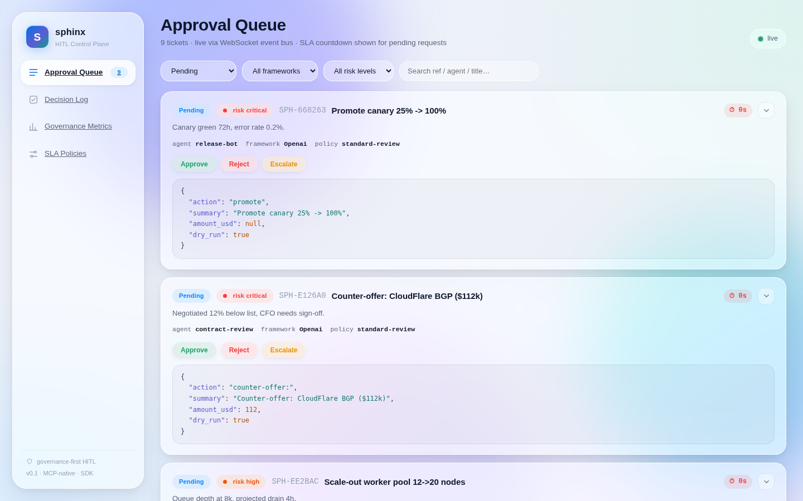
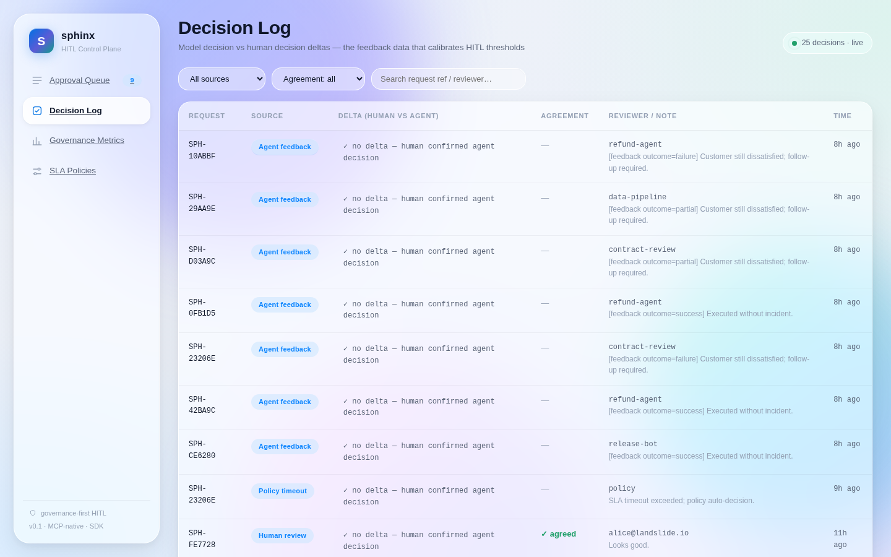
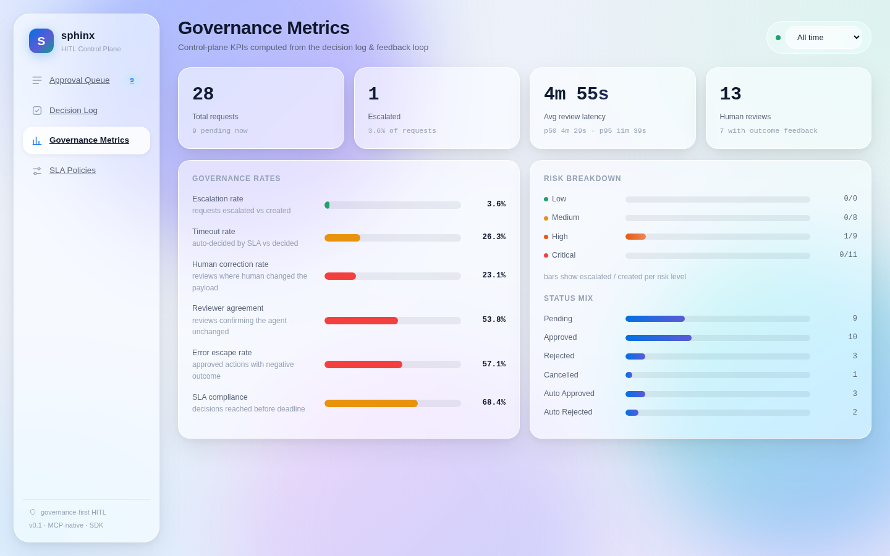
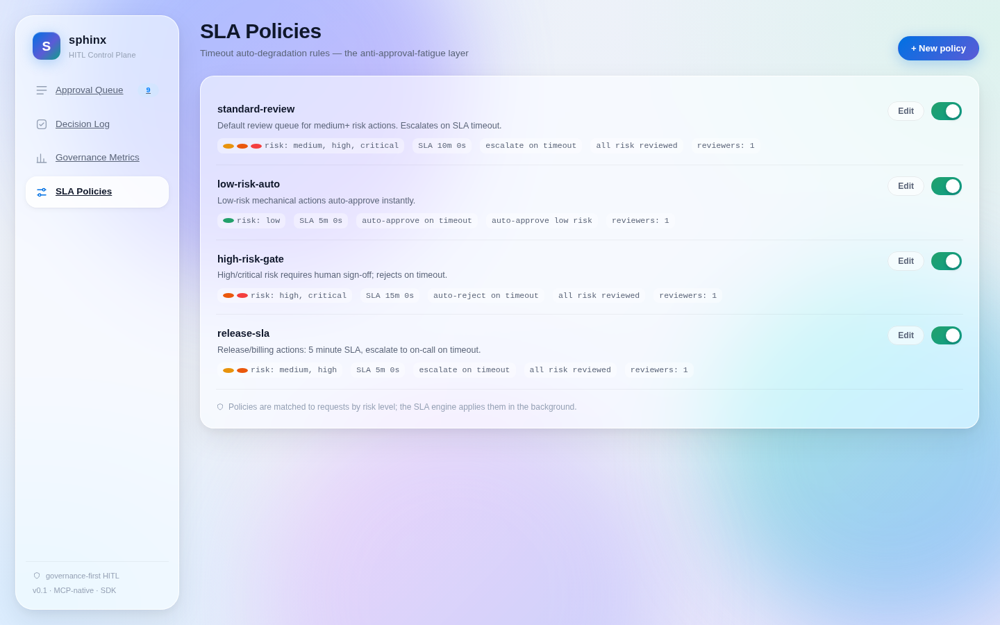

# Sphinx · Agent HITL Control Plane

**Framework-agnostic, self-hosted, open-source human-in-the-loop approval control plane for agent workflows.**

Sphinx is the missing middle layer between agent frameworks and the humans who must supervise them. It sits *between* LangGraph / OpenAI SDK / CrewAI / any MCP-capable agent and the reviewer, and gives you the things every framework leaves out:

- **Unified approval entry point** — one web console + one approval queue for *every* framework, instead of one bespoke UI per framework.
- **Approval SLA with auto-degradation** — timeouts that escalate, auto-approve or auto-reject per policy, so "human-in-the-loop" does not decay into "blind clicking OK".
- **Decision log & feedback loop** — records the delta between what the agent proposed and what a human decided, and feeds governance metrics: escalation rate, error escape rate, reviewer agreement, correction rate, SLA compliance, decision latency.
- **MCP-native** — every capability is exposed as MCP tools, aligned with the 2026 protocol convergence direction. Any MCP-capable agent can request approval without new SDK code.
- **Framework-agnostic SDK** — one Python SDK with drop-in adapters for LangGraph, OpenAI tool-calling and CrewAI.

---

## Screenshots

The web console ships with a live approval queue, a searchable decision log, governance KPIs and editable SLA policies.

| Approval Queue | Decision Log |
|---|---|
|  |  |

| Governance Metrics | SLA Policies |
|---|---|
|  |  |

---

## Repository layout

```
.
├── backend/              FastAPI + SQLAlchemy control plane (REST API, WebSocket, MCP server, policy engine, metrics)
│   └── sphinx/
│       ├── api/          REST + WebSocket endpoints
│       ├── core/         policy engine, metrics, event bus, delta diffing, shared services
│       ├── mcp/          FastMCP server exposing sphinx_* tools
│       └── models.py     ApprovalRequest / Policy / DecisionLog
├── sdk/                  Python SDK + framework adapters (sphinx-sdk)
│   └── sphinx_sdk/       SphinxClient (REST or MCP transport), HITLGuard, ApprovalGate, CrewAI callback
├── web/                  React + Vite + TS console: Queue / Decisions / Metrics / Policies
├── docker/               Dockerfiles + nginx proxy config
├── docker-compose.yml    one-command stack: api :8001, mcp :8100, web :8080
└── docs/                 full documentation set (see below)
```

## Documentation

| doc | contents |
|-----|----------|
| `docs/USER_GUIDE.md` | **start here** — install, run, use the console, connect agents, configure, deploy, troubleshoot |
| `docs/ARCHITECTURE.md` | system design: components, data model, event bus, policy engine, metrics |
| `docs/API.md` | full REST + WebSocket reference with JSON examples |
| `docs/MCP.md` | MCP tools and resource, config snippets, transport options |
| `docs/SDK.md` | `SphinxClient` API and LangGraph / OpenAI / CrewAI adapters |
| `docs/TEST_REPORT.md` | test coverage and results, bug log, live verification evidence |

---

## Quick start

### Option A — Docker Compose

```bash
docker compose up --build
```

| Service | URL |
|---------|-----|
| Web console | http://localhost:8080 |
| REST API | http://localhost:8001/api |
| MCP endpoint | http://localhost:8100/mcp |
| Live events (WS) | ws://localhost:8001/api/ws |

The stack boots with default policies and 28 rows of realistic demo data, so every page is populated immediately.

### Option B — local development

```bash
# backend (API on :8001 + MCP on :8100)
python -m venv .venv && .venv/bin/pip install -e "backend[dev]"
SPHINX_SEED_DEMO_DATA=1 .venv/bin/sphinx-api            # REST + WS
.venv/bin/python -m sphinx.mcp.server --http            # MCP on :8100

# web console (dev server on :5173, proxies /api and /mcp)
cd web && npm install && npm run dev
```

Open http://localhost:5173 — the dev server already proxies `/api` to `:8001` and `/mcp` to `:8100`.

### Option C — run the demo agent

The demo exercises the full HITL lifecycle over REST or MCP transport: propose a risky action → a simulated human approves it → the agent reads the final payload and reports the outcome.

```bash
# terminal 1: start API + MCP as above (Option B)

# terminal 2: agent over MCP transport (default)
.venv/bin/python sdk/examples/demo_agent.py --transport mcp

# or over plain REST, and let the SLA policy decide instead of a simulated human
.venv/bin/python sdk/examples/demo_agent.py --transport rest --no-auto-review
```

---

## Core concepts

### Approval requests

An agent submits an `action_payload` for approval with a `risk_level` (`low`/`medium`/`high`/`critical`). Sphinx picks a matching policy, stamps an SLA deadline, and the request lands in the queue.

- `low` risk under a `low-risk-auto` policy → **instant auto-approve** (humans only see things that matter).
- otherwise it stays `pending` until a human approves/rejects, the agent cancels, or the SLA fires.

### Policies & SLA auto-degradation

A background engine (`sphinx.core.policy_engine`) scans pending requests every second. When a request exceeds its `timeout_seconds`, the policy's `on_timeout` action runs:

| `on_timeout` | effect |
|--------------|--------|
| `escalate`   | marks the request escalated (stays pending, shows in console) |
| `auto_approve` | auto-approves with the agent's payload |
| `auto_reject`  | auto-rejects |

This is the anti-fatigue layer: if nobody looks at a ticket in time, the policy decides deterministically instead of leaving the agent stuck forever.

### Decision log & governance metrics

Every decision is written to `decision_logs` with:

- `agent_decision` — what the model proposed
- `human_decision` — what actually happened (may be amended)
- `delta` — a path-level diff of the two payloads (`add` / `remove` / `replace`)
- `agreement` — did the human confirm the agent unchanged?
- `source` — `human_review` / `policy_timeout` / `auto_policy` / `agent_feedback`

The metrics endpoint turns that log into governance KPIs:

| metric | definition |
|--------|-----------|
| `escalation_rate` | escalated requests / total created |
| `timeout_rate` | SLA auto-decided / decided |
| `correction_rate` | human reviews that changed the payload / human reviews |
| `reviewer_agreement` | human reviews confirming the agent unchanged |
| `error_escape_rate` | approved actions reported with a negative outcome / approved with feedback |
| `sla_compliance_rate` | decisions reached before the SLA deadline / decided |
| latency | avg / p50 / p95 human review decision latency |

### Live events

Mutations publish to an in-process event bus; the WebSocket endpoint `/api/ws` fans them out (`requests`, `decisions`, `policies` topics). The console uses this for instant badge updates (and falls back to polling).

---

## Using Sphinx from your agents

### Via MCP (any framework)

```jsonc
// mcp config
{
  "mcpServers": {
    "sphinx": { "url": "http://localhost:8100/mcp" }
  }
}
```

Tools: `sphinx_request_approval`, `sphinx_get_status`, `sphinx_wait_for_decision`, `sphinx_get_decision`, `sphinx_submit_feedback`, `sphinx_list_policies`.

### Via the Python SDK

```python
from sphinx_sdk import SphinxClient

with SphinxClient(transport="mcp", agent_id="refund-agent") as sphinx:
    ticket = sphinx.request_approval(
        "Approve refund of $980 for order ORD-77241",
        {"action": "refund", "order_id": "ORD-77241", "amount_usd": 980.0},
        risk_level="medium",
    )
    decision = sphinx.wait_for_decision(ticket.id)
    if decision["approved"]:
        # execute with the (possibly human-amended) payload
        run_refund(decision["decision_payload"])
    sphinx.submit_feedback(ticket.id, outcome="success", note="done")
```

### Framework adapters

- **LangGraph** — `HITLGuard.guard()` wraps a node; `hitl_interrupt_node()` returns a ready-to-use node function.
- **OpenAI** — `ApprovalGate.check(tool_call)` validates a tool call before execution.
- **CrewAI** — `sphinx_human_input(agent_id)` builds the `human_input` callback.

See `docs/SDK.md` for each pattern.

---

## Testing

```bash
cd backend
../.venv/bin/python -m pytest -q          # 107 tests: unit + API + WS + MCP + SDK + demo agent E2E
```

The suite covers the service layer, delta diffing, metrics math, the SLA scheduler, the full REST surface, WebSocket live events, MCP tools over a real streamable-HTTP server, the SDK transports and adapters, seed data, and a live end-to-end demo-agent run. Full results in `docs/TEST_REPORT.md`.

---

## Configuration

All settings are read from `SPHINX_*` environment variables (see `backend/sphinx/config.py`):

| variable | default | purpose |
|----------|---------|---------|
| `SPHINX_DATABASE_URL` | `sqlite:///./sphinx.db` | SQLAlchemy URL |
| `SPHINX_API_PORT` | `8001` | REST API + WS port |
| `SPHINX_MCP_PORT` | `8100` | MCP streamable HTTP port |
| `SPHINX_SCHEDULER_INTERVAL_SECONDS` | `1.0` | SLA engine tick interval |
| `SPHINX_DEFAULT_POLICY_SEED` | `true` | seed the 4 default policies at startup |
| `SPHINX_SEED_DEMO_DATA` | `false` | seed 28 demo requests at startup |
| `SPHINX_CORS_ORIGINS` | `*` | CORS allow-list |
| `SPHINX_LOG_LEVEL` | `info` | log level |

## License

Open source. Built for the LANDSLIDE human-computer collaboration initiative.
